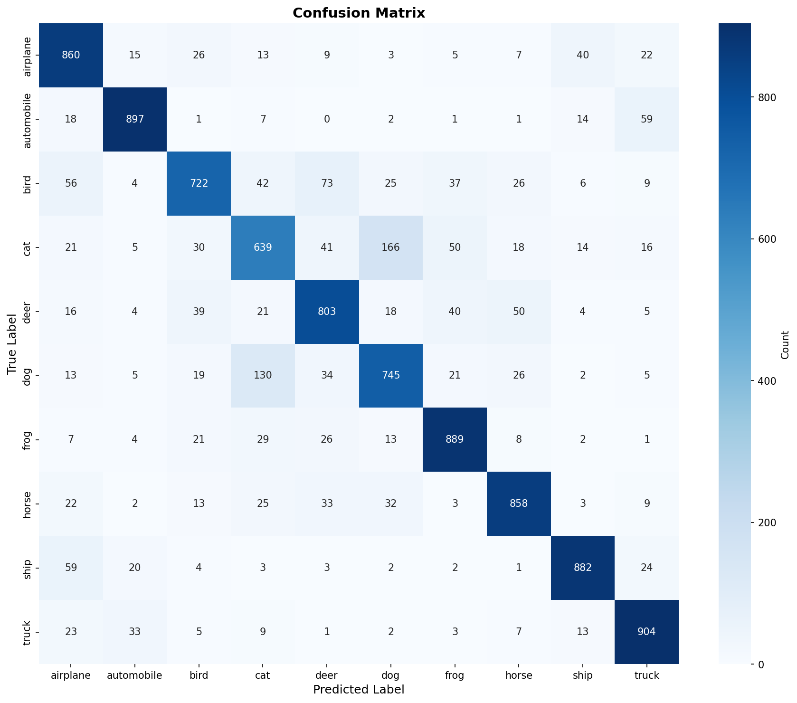

# Vision Transformer (ViT) for CIFAR-10 Classification


---

A PyTorch implementation of Vision Transformer (ViT) for image classification on the CIFAR-10 dataset. This project implements the architecture from scratch, including patch extraction, positional encoding, multi-head self-attention, and transformer encoder blocks.


## 🎯 Project Overview

This project demonstrates:
- **Custom ViT Architecture**: Built from scratch using PyTorch
- **Modular Design**: Clean, reusable code structure
- **Complete Pipeline**: Data loading, training, evaluation, and visualization
- **Best Practices**: Configuration management, checkpointing, logging, and reproducibility

## 📊 Results

| Metric | Value |
|--------|-------|
| Test Accuracy | XX.XX% |
| Top-5 Accuracy | XX.XX% |
| Parameters | 21.4M |
| Training Time | 10 hours |

## 🏗️ Architecture

The Vision Transformer consists of:

1. **Patch Extraction**: Splits 72×72 images into 6×6 patches (144 patches total)
2. **Patch Encoding**: Linear projection + positional embeddings
3. **Transformer Encoder**: 8 layers with multi-head attention (4 heads, 64-dim)
4. **Classification Head**: MLP with 2048→1024 units

### Key Hyperparameters

```yaml
Image Size: 72×72
Patch Size: 6×6
Projection Dim: 64
Transformer Layers: 8
Attention Heads: 4
Batch Size: 256
Learning Rate: 0.001
```

## 🚀 Quick Start

### Installation

```bash
# Clone the repository
git clone https://github.com/yourusername/vit-cifar10-pytorch.git
cd vit-cifar10-pytorch

# Create virtual environment
python -m venv venv
source venv/bin/activate  # On Windows: venv\Scripts\activate

# Install dependencies
pip install -r requirements.txt
```

### Training

```bash
# Train with default config
cd src
python train.py --config ../config.yaml

# Resume from checkpoint
python train.py --config ../config.yaml --resume ../results/checkpoints/checkpoint_epoch_50.pth
```

### Configuration

Edit `config.yaml` to customize:
- Model architecture (layers, heads, dimensions)
- Training hyperparameters (learning rate, batch size, epochs)
- Data augmentation settings
- Optimizer and scheduler options

## 📁 Project Structure

```
vit-cifar10-pytorch/
├── README.md              # This file
├── requirements.txt       # Python dependencies
├── config.yaml           # Hyperparameters and settings
├── LICENSE               # MIT License
│
├── src/                  # Source code
│   ├── __init__.py
│   ├── model.py          # ViT architecture
│   ├── data.py           # Data loading & augmentation
│   ├── train.py          # Training script
│   └── utils.py          # Helper functions
│
├── notebooks/            # Jupyter notebooks
│   ├── exploration.ipynb # Data exploration
│   └── visualizations.ipynb # Results & attention maps
│
├── results/              # Training outputs
│   ├── checkpoints/      # Model checkpoints
│   ├── plots/            # Training curves, confusion matrix
│   └── logs/             # TensorBoard logs
│
└── docs/                 # Documentation
    └── architecture.md   # Detailed architecture explanation
```

## 📈 Monitoring Training

### TensorBoard

```bash
tensorboard --logdir results/logs
```

View training metrics at `http://localhost:6006`

### Generated Plots

Training automatically generates:
- `training_curves.png` - Loss and accuracy over time
- `confusion_matrix.png` - Per-class performance
- `predictions.png` - Sample predictions
- `classification_report.txt` - Detailed metrics

<!-- ## 🔬 Experiments & Ablations

Experiments with different configurations:

| Config | Layers | Heads | Dim | Accuracy |
|--------|--------|-------|-----|----------|
| Base   | 8      | 4     | 64  | XX.XX%   |
| Small  | 6      | 4     | 64  | XX.XX%   |
| Deep   | 12     | 4     | 64  | XX.XX%   |
| Wide   | 8      | 8     | 128 | XX.XX%   | -->

## 🎨 Visualizations

### Attention Maps

See `notebooks/visualizations.ipynb` for:
- What patches the model focuses on
- How attention changes across layers
- Per-class attention patterns

### Training Curves


### Confusion Matrix



## 🛠️ Key Features

- ✅ **Mixed Precision Training**: Faster training with AMP
- ✅ **Gradient Clipping**: Stable training
- ✅ **Learning Rate Scheduling**: Cosine annealing, step decay, plateau
- ✅ **Data Augmentation**: Random flip, rotation, crop, color jitter
- ✅ **Checkpointing**: Save/resume training
- ✅ **TensorBoard Integration**: Real-time monitoring
- ✅ **Reproducibility**: Fixed random seeds
- ✅ **Modular Design**: Easy to extend and modify

## 📊 Dataset

**CIFAR-10** consists of 60,000 32×32 color images in 10 classes:
- Training: 50,000 images (45,000 train / 5,000 val)
- Testing: 10,000 images

Classes: airplane, automobile, bird, cat, deer, dog, frog, horse, ship, truck

## 🔧 Advanced Usage

### Custom Model Configuration

```python
# In config.yaml
model:
  patch_size: 8              
  projection_dim: 128        
  num_heads: 8               
  transformer_layers: 12     
```

### Custom Augmentation

```python
# In config.yaml
augmentation:
  random_flip: true
  random_rotation: 15
  color_jitter: true
  random_crop_scale: [0.8, 1.0]
```

### Using Pretrained Weights

```python
from src.model import create_model
import torch

config = load_config('config.yaml')
model = create_model(config)
checkpoint = torch.load('results/checkpoints/checkpoint_epoch_1_best.pth')
model.load_state_dict(checkpoint['model_state_dict'])
```

## 📚 References

1. **An Image is Worth 16x16 Words**: Dosovitskiy et al., 2021
   - [Paper](https://arxiv.org/abs/2010.11929)
   - [Official Code](https://github.com/google-research/vision_transformer)

2. **Attention Is All You Need**: Vaswani et al., 2017
   - [Paper](https://arxiv.org/abs/1706.03762)

## 🤝 Contributing

Contributions are welcome! Please feel free to submit a Pull Request.

1. Fork the repository
2. Create your feature branch (`git checkout -b feature/AmazingFeature`)
3. Commit your changes (`git commit -m 'Add some AmazingFeature'`)
4. Push to the branch (`git push origin feature/AmazingFeature`)
5. Open a Pull Request

## 📝 TODO

- [ ] Add more augmentation techniques (Mixup, CutMix)
- [ ] Implement knowledge distillation
- [ ] Add model export to ONNX
- [ ] Create web demo with Gradio
- [ ] Benchmark on other datasets (CIFAR-100, ImageNet)
- [ ] Implement hybrid CNN-ViT architecture

## 📄 License

This project is licensed under the MIT License - see the [LICENSE](LICENSE) file for details.

## 🙏 Acknowledgments

- Original ViT paper by Google Research
- PyTorch team for the excellent deep learning framework
- CIFAR-10 dataset creators

## 📧 Contact

Debasish Paul - [LinkedIn](www.linkedin.com/in/debasishpaul999) - www.debasish999@gmail.com.com

Project Link: [https://github.com/debasishpaul999/vit_classifier.git](https://github.com/debasishpaul999/vit_classifier.git)

---

⭐ Star this repo if you find it helpful!
