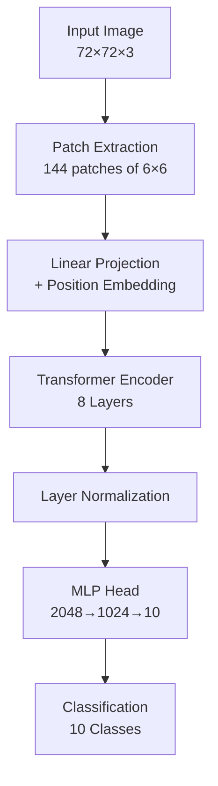

# Vision Transformer Architecture


*A comprehensive guide to the Vision Transformer implementation for CIFAR-10 classification*


This document provides a detailed explanation of the Vision Transformer (ViT) architecture implemented in this project.

## Table of Contents
1. [Overview](#overview)
2. [Input Processing](#input-processing)
3. [Patch Extraction](#patch-extraction)
4. [Patch Encoding](#patch-encoding)
5. [Transformer Encoder](#transformer-encoder)
6. [Classification Head](#classification-head)
7. [Mathematical Formulation](#mathematical-formulation)


## Overview

The Vision Transformer treats an image as a sequence of patches, similar to how text transformers treat sentences as sequences of words. The key insight is that self-attention mechanisms can capture spatial relationships without convolutional operations.



## Input Processing

### Image Preprocessing

1. **Resize**: Original CIFAR-10 images (32×32) are resized to 72×72
2. **Normalization**: Images are normalized with ImageNet statistics
   - Mean: [0.485, 0.456, 0.406]
   - Std: [0.229, 0.224, 0.225]

3. **Data Augmentation** (Training only):
   - Random horizontal flip
   - Random rotation (±7.2°)
   - Random resized crop (80-100% scale)
   - Optional color jitter

### Why Resize to 72×72?

- Allows clean division into 6×6 patches (12×12 = 144 patches)
- Provides more spatial information than 32×32
- Reasonable computational cost vs. larger sizes

## Patch Extraction

### Implementation

Images are divided into non-overlapping patches:

```python
patch_size = 6
num_patches = (72 // 6) ** 2 = 144
patch_dim = 3 * 6 * 6 = 108
```

Each 72×72×3 image becomes a sequence of 144 patches, where each patch is a 108-dimensional vector.

### PyTorch Implementation

```python
def extract_patches(images, patch_size):
    # images: (B, 3, 72, 72)
    patches = images.unfold(2, patch_size, patch_size).unfold(3, patch_size, patch_size)
    # patches: (B, 3, 12, 12, 6, 6)
    patches = patches.contiguous().view(B, 3, -1, patch_size, patch_size)
    # patches: (B, 3, 144, 6, 6)
    patches = patches.permute(0, 2, 1, 3, 4)
    # patches: (B, 144, 3, 6, 6)
    patches = patches.contiguous().view(B, 144, 108)
    # patches: (B, 144, 108)
    return patches
```

## Patch Encoding

### Linear Projection

Each patch is projected to a higher-dimensional space:

```python
projection = nn.Linear(108, 64)
# Maps each 108-dim patch to 64-dim embedding
```

### Positional Embedding

Since self-attention is permutation-invariant, we add learnable positional embeddings:

```python
position_embedding = nn.Embedding(144, 64)
positions = torch.arange(0, 144)
encoded = projection(patches) + position_embedding(positions)
```

**Why learnable positions?**
- Allows model to learn optimal spatial relationships
- More flexible than fixed sinusoidal embeddings for small sequences
- Works well for 2D spatial structures

### Output

Shape: `(batch_size, 144, 64)`

Each image is now represented as 144 tokens of 64 dimensions each.

## Transformer Encoder

### Architecture

We use 8 transformer encoder blocks, each containing:

1. **Layer Normalization**
2. **Multi-Head Self-Attention**
3. **Residual Connection**
4. **Layer Normalization**
5. **MLP (Feed-Forward Network)**
6. **Residual Connection**

### Multi-Head Self-Attention

```python
num_heads = 4
head_dim = 64 // 4 = 16

MultiHeadAttention(
    embed_dim=64,
    num_heads=4,
    dropout=0.1
)
```

**What does it do?**
- Computes attention between all pairs of patches
- Each head learns different spatial relationships
- Allows model to focus on relevant image regions

**Attention Formula:**

```
Q, K, V = Linear(x), Linear(x), Linear(x)
Attention(Q, K, V) = softmax(QK^T / √d_k) V
```

Where:
- Q: Query (what am I looking for?)
- K: Key (what do I contain?)
- V: Value (what information do I have?)
- d_k: dimension per head (16)

### MLP Block

```python
MLP(x) = GELU(Linear(64 → 128)(x))
       → Dropout(0.1)
       → GELU(Linear(128 → 64)(x))
       → Dropout(0.1)
```

**Why 2× expansion?**
- Standard transformer practice (expand then compress)
- Allows more expressiveness in the hidden layer
- Followed by original ViT paper

### Residual Connections

```python
x = x + MultiHeadAttention(LayerNorm(x))
x = x + MLP(LayerNorm(x))
```

**Benefits:**
- Easier gradient flow (addresses vanishing gradients)
- Allows network to learn identity function
- Enables training of deep networks

## Classification Head

### Structure

After 8 transformer blocks:

```python
x = LayerNorm(x)           # (B, 144, 64)
x = Flatten(x)             # (B, 9216)
x = Dropout(0.5)(x)        
x = Linear(9216 → 2048)(x) # MLP layer 1
x = GELU(x)
x = Dropout(0.5)(x)
x = Linear(2048 → 1024)(x) # MLP layer 2
x = GELU(x)
x = Dropout(0.5)(x)
logits = Linear(1024 → 10)(x) # Classification
```

### Why this structure?

1. **Flatten all tokens**: Aggregate information from all patches
2. **Large MLP**: 2048 and 1024 hidden units for complex decision boundary
3. **High dropout**: 0.5 prevents overfitting on small dataset
4. **GELU activation**: Smooth, performs better than ReLU in transformers

### Alternative: [CLS] Token

Standard ViT uses a learnable [CLS] token:

```python
cls_token = nn.Parameter(torch.randn(1, 1, 64))
x = torch.cat([cls_token.expand(B, -1, -1), encoded_patches], dim=1)
# Only use cls_token output for classification
```

We chose **flattening** approach for:
- Simpler implementation
- Uses information from all patches
- Works well on small images

## Mathematical Formulation

### Complete Forward Pass

Given input image **I** ∈ ℝ^(72×72×3):

**Step 1: Patch Extraction**
```
P = Extract(I) ∈ ℝ^(144×108)
```


**Step 2: Linear Projection + Positional Embedding**
```
Z₀ = PW_E + E_pos
where:
  W_E ∈ ℝ^(108×64) - projection matrix
  E_pos ∈ ℝ^(144×64) - positional embeddings
  Z₀ ∈ ℝ^(144×64) - encoded patches
```

**Step 3: Transformer Encoder (repeated L=8 times)**
```
For l = 1 to L:
  Z'_l = MSA(LN(Z_{l-1})) + Z_{l-1}
  Z_l = MLP(LN(Z'_l)) + Z'_l

where:
  MSA() - Multi-Head Self-Attention
  LN() - Layer Normalization
  MLP() - Feed-Forward Network
```

**Step 4: Classification**
```
y = W_c · MLP_head(Flatten(LN(Z_L)))
where:
  W_c ∈ ℝ^(10×1024) - classifier weights
  y ∈ ℝ^10 - class logits
```

### Multi-Head Self-Attention Detail

For each attention head h:

```
Q_h = Z_{l-1}W^Q_h,  K_h = Z_{l-1}W^K_h,  V_h = Z_{l-1}W^V_h

Attention_h = softmax(Q_hK^T_h / √d_k)V_h

MSA(Z_{l-1}) = Concat(Attention_1, ..., Attention_H)W^O
```

Where:
- H = 4 (number of heads)
- d_k = 16 (dimension per head)
- W^Q, W^K, W^V ∈ ℝ^(64×16) for each head
- W^O ∈ ℝ^(64×64) (output projection)

## Key Design Decisions

### 1. Patch Size: 6×6

**Rationale:**
- Smaller patches = more tokens = better fine-grained information
- But: more computational cost (quadratic in sequence length)
- 6×6 gives good balance for 72×72 images
- Creates 144 patches (manageable sequence length)

**Trade-offs:**
| Patch Size | Num Patches | Computation | Detail |
|------------|-------------|-------------|--------|
| 4×4 | 324 | Very High | Excellent |
| 6×6 | 144 | Medium | Good |
| 8×8 | 81 | Low | Fair |
| 12×12 | 36 | Very Low | Poor |

### 2. Projection Dimension: 64

**Rationale:**
- Smaller than standard ViT (768) due to smaller dataset
- Reduces parameters and overfitting risk
- Still sufficient for CIFAR-10 complexity
- Can be increased for better performance (at cost of computation)

### 3. Number of Layers: 8

**Rationale:**
- Deeper than simple CNNs but shallower than large ViTs
- Good receptive field coverage
- Enough capacity without overfitting
- Each layer refines patch relationships

**Receptive Field Growth:**
- Layer 1: Each token attends to all 144 tokens
- Layer 2: Second-order relationships
- Layer 8: High-level abstract features

### 4. Number of Heads: 4

**Rationale:**
- Multiple perspectives on patch relationships
- Each head can specialize (e.g., edges, textures, shapes)
- 4 heads with 16 dim each = 64 total (clean division)

**What heads might learn:**
- Head 1: Local neighborhoods
- Head 2: Long-range dependencies  
- Head 3: Object boundaries
- Head 4: Semantic regions

### 5. MLP Expansion: 2×

**Rationale:**
- Standard transformer practice
- 64 → 128 → 64 in encoder
- Provides non-linear transformation capacity
- Helps model learn complex features

## Computational Complexity

### Memory Requirements

**Model Parameters:**
```
Patch Encoder:     108 × 64 + 144 × 64 = 16,128
Transformer (×8):  ~2.1M parameters
  - Self-Attention: 4 × (64 × 64 × 3) = 49,152 per layer
  - MLP: 64 × 128 + 128 × 64 = 16,384 per layer
MLP Head:          9,216 × 2,048 + 2,048 × 1,024 + 1,024 × 10 = ~21M
Classifier:        1,024 × 10 = 10,240

Total: ~23M parameters
```

### Time Complexity

**Forward Pass:**
- Patch Extraction: O(HW) = O(72²) = O(5,184)
- Self-Attention: O(N²d) = O(144² × 64) ≈ O(1.3M) per layer
- MLP: O(Nd²) = O(144 × 64²) ≈ O(589K) per layer
- Total per image: ~O(20M) operations

**Training (Batch Size 256):**
- Forward: 256 × 20M = 5.1B operations
- Backward: ~2-3× forward = 10-15B operations
- Total per batch: ~15-20B operations

## Comparison with CNNs

| Aspect | ViT | CNN |
|--------|-----|-----|
| **Inductive Bias** | Minimal | Strong (locality, translation) |
| **Receptive Field** | Global from layer 1 | Grows gradually |
| **Parameters** | More | Fewer |
| **Data Efficiency** | Needs more data | Works with less |
| **Interpretability** | Attention maps | Feature maps |
| **Long-range Dependencies** | Excellent | Limited |

## Attention Patterns

### What the model learns:

**Early Layers (1-3):**
- Local patch relationships
- Edges and textures
- Similar to CNN early layers

**Middle Layers (4-6):**
- Object parts
- Spatial grouping
- Intermediate semantics

**Late Layers (7-8):**
- Global object structure
- Semantic relationships
- Class-discriminative features

## Optimization Challenges

### 1. Overfitting on Small Datasets

**Solutions:**
- Heavy data augmentation
- High dropout rates (0.1 in encoder, 0.5 in head)
- Weight decay (0.0001)
- Early stopping

### 2. Training Instability

**Solutions:**
- Layer normalization (not batch norm)
- Gradient clipping
- Warmup learning rate schedule
- Residual connections

### 3. Slow Convergence

**Solutions:**
- AdamW optimizer (better than SGD for transformers)
- Cosine annealing schedule
- Mixed precision training
- Larger batch sizes (256)

## Extensions and Improvements

### 1. Hybrid Architecture
- Add CNN stem before patch extraction
- Benefit: Better low-level features

### 2. Hierarchical Structure (Swin Transformer)
- Multi-scale patch processing
- Shifted windows for efficiency

### 3. Knowledge Distillation
- Train with teacher model
- Improves accuracy on small datasets

### 4. Advanced Augmentations
- Mixup: Blend image pairs
- CutMix: Paste image patches
- RandAugment: Automated augmentation

### 5. Relative Position Embeddings
- More flexible than absolute positions
- Better generalization to different sizes

## References

1. Dosovitskiy, A., et al. (2021). "An Image is Worth 16x16 Words: Transformers for Image Recognition at Scale"
2. Vaswani, A., et al. (2017). "Attention Is All You Need"
3. Touvron, H., et al. (2021). "Training data-efficient image transformers"
4. Liu, Z., et al. (2021). "Swin Transformer: Hierarchical Vision Transformer using Shifted Windows"

---

This architecture successfully applies transformer concepts to computer vision, achieving competitive results on CIFAR-10 while maintaining interpretability through attention visualizations.